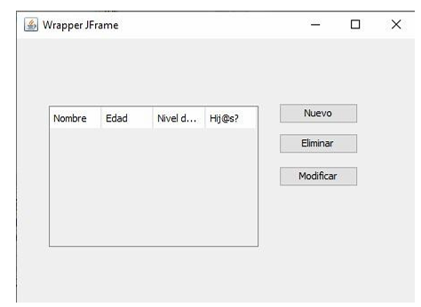
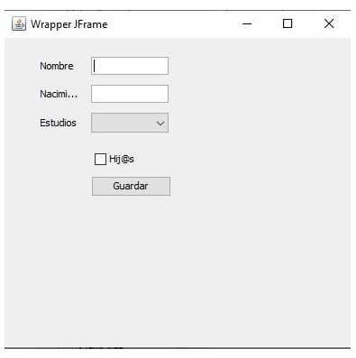
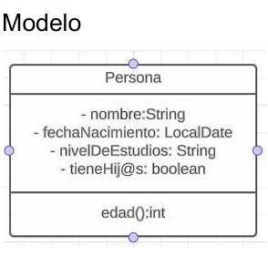

# recuperatorio diciembre de taller

Hacer un ***ABM*** para la base de datos.

La parte visual debe ser:

+ pantalla 1 

+ pantalla 2: 

Modelo:

el guion de la base de datos es `diciembre.session.sql`

puede faltar el plugin o coso para la coneccion con la bd, pero bue, que se le va a hacer